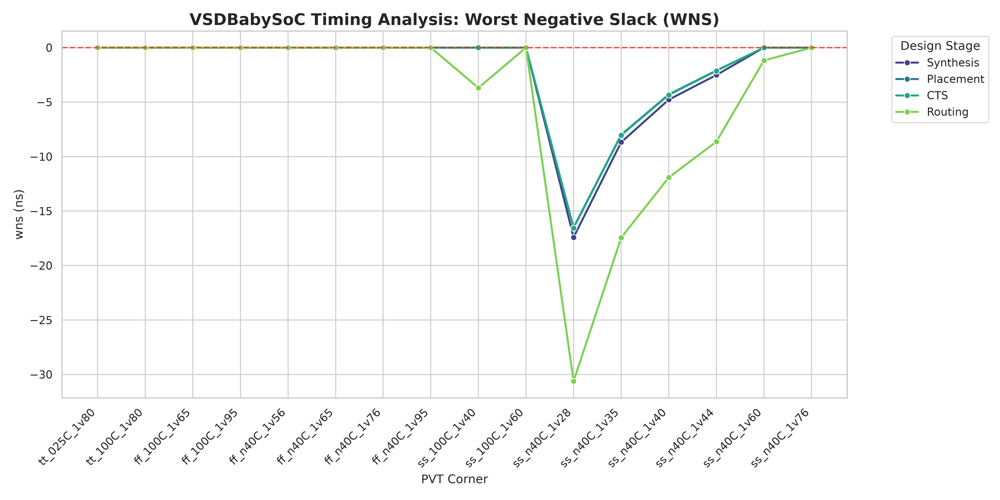
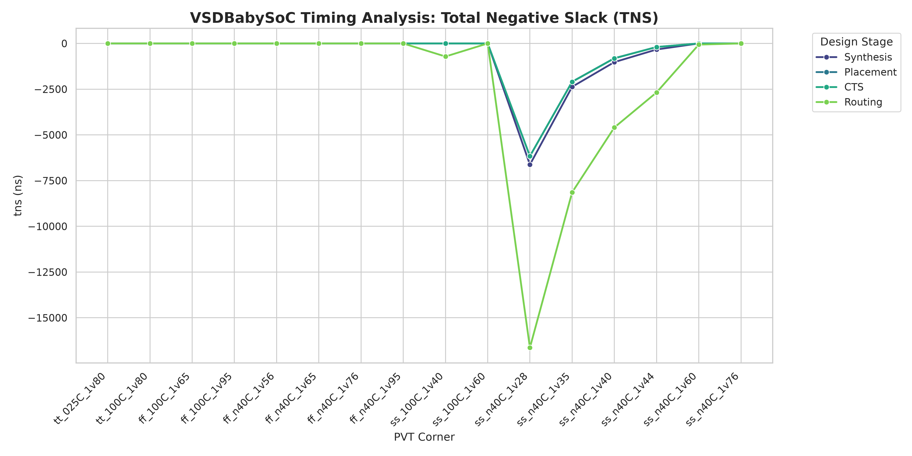
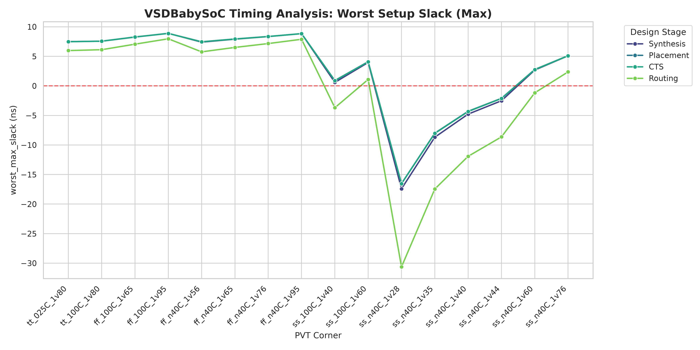
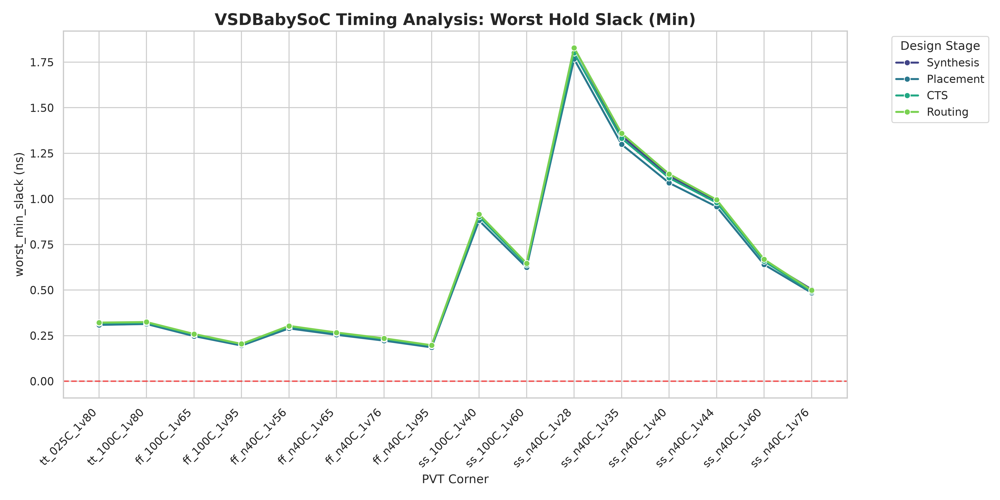

# VSDBabySoC Physical Design
VSDBabySoC is a small SoC including PLL, DAC, and a RISCV-based processor named RVMYTH. This section aims to be a direct continuation of the original analysis completed for [VSDBabySoC](https://github.com/sidj21/soc_design/tree/main/VSDBabySoC). The linked directory covered pre-synthesis simulation, post-synthesis simulation, and Static Timing Analysis (STA) before any cells were placed. 

As per the ASIC flow, the next stage is physical design, which includes incrementally laying out the physical organization of the chip. After each milestone, STA is applied after each iteration. Earlier steps in the pipeline estimate various attributes of the wire load, such as their physical location and resistance.   

As the EDA tool finalizes these decisions and extracts information that better represent how the chip will behave in real-life, STA must be applied again to avoid bugs. This process also helps engineers isolate setup and hold violations to a specific action.

### Physical Design Flow
```
    ┌──────────────────────────┐
    │  Floorplanning / Power   │─────────┐
    └──────────────────────────┘         │
                 │                       │
                 ▼                       ▼
    ┌──────────────────────────┐       ┌──────────────────────────┐
    │   Placement (Global)     │─────> │                          │
    └──────────────────────────┘       │                          │
                 │                     │                          │
                 ▼                     │                          │
    ┌──────────────────────────┐       │                          │
    │   Clock Tree Synthesis   │─────> │  Static Timing Analysis  │
    │          (CTS)           │       │          (STA)           │
    └──────────────────────────┘       │                          │
                 │                     │                          │
                 ▼                     │                          │
    ┌──────────────────────────┐       │  (Checks timing closures │
    │     Detailed Routing     │─────> │   after every major      │
    └──────────────────────────┘       │        milestone)        │
                 │                     │                          │
                 ▼                     │                          │
    ┌──────────────────────────┐       │                          │
    │  RC Extraction & Filling │──────>│                          │
    └──────────────────────────┘       └──────────────────────────┘
                 │
                 ▼
    ┌──────────────────────────┐
    │ Physical Verification &  │
    │         Tape-Out         │
    └──────────────────────────┘
```

### System Architecture
```
                    ┌─────────────────────────────────────────┐
                    │         VSDBabySoC                      │
                    │                                         │
   VCO_IN ──────────┤►                                        │
   ENb_CP ──────────┤►   ┌──────────┐                         │
   ENb_VCO ─────────┤►   │ avsdpll  │                         │
   REF ─────────────┤►   │   (PLL)  │                         │
                    │    └─────┬────┘                         │
                    │          │ CLK (Generated Clock)        │
                    │          ▼                              │
                    │    ┌─────────────────┐                  │
   reset ───────────┤►   │    rvmyth       │                  │
                    │    │  (RISC-V CPU)   │                  │
                    │    │   RV32I Core    │                  │
                    │    └────────┬────────┘                  │
                    │             │ OUT[9:0]                  │
                    │             ▼                           │
                    │    ┌──────────────┐                     │
                    │    │  avsddac     │                     │
                    │    │  (10-bit DAC)│─────────────────────┤► OUT
                    │    └──────────────┘                     │
                    └─────────────────────────────────────────┘
```

### Design Hierarchy
```
vsdbabysoc (top)
├── core (rvmyth - RISC-V CPU)
│   ├── rvmyth_gen (generated by Sandpiper)
│   └── clk_gate (clock gating cell)
├── pll (avsdpll - Phase-Locked Loop)
└── dac (avsddac - Digital-to-Analog Converter)
```

## Pre-requisites
* ✦ [OpenROAD Flow Scripts](https://github.com/sidj21/soc_design/blob/main/OpenROAD/02-installation.md) ✦
* ✦ [SkyWater PDK Library](https://github.com/fossi-foundation/skywater-pdk-libs-sky130_fd_sc_hd) ✦
* [VSDBabySoC Source Code](https://github.com/manili/VSDBabySoC)
* [Sandpiper-Saas](https://pypi.org/project/sandpiper-saas/)

> [!IMPORTANT]
> This section is the newer version of the [OpenROAD Analysis](https://github.com/sidj21/soc_design/blob/main/OpenROAD/03-analysis.md) completed prior in this repository. There were hidden bugs in the technology file (LEF) and the OpenROAD configuration which are fixed and documented here. It is also recommended to follow the setup below, as the VSDBabySoC source code contains faults that Verilator catches.

## Structure
```
├───images
├───openroad
│   ├───results
│   └───vsdbabysoc
│       ├───gds
│       ├───include
│       ├───lef
│       ├───lib
│       └───src
├───scripts
├───sta_outputs
│   ├───post_cts
│   ├───post_place
│   ├───post_route
│   └───post_synth
└───README.md
```

## Setup
The setup is quite simple once you grab all of the required files:
* Copy the design source files from this repository into the OpenROAD designs directory
* Move the SkyWater130 PDK libraries files into the OpenROAD platforms directory
* Move the TCL scripts from this repository to analyze the STA into the OpenROAD directory 
```
cd ~
git clone https://github.com/sidj21/soc_design.git
cp -r ~/soc_design/VSDBabySoC-PD/openroad/vsdbabysoc ~/OpenROAD-flow-scripts/flow/designs/sky130hd
cp -r ~/skywater-pdk-libs-sky130_fd_sc_hd/timing ~/OpenROAD-flow-scripts/flow/platforms/sky130hd/lib
cp -r ~/soc_design/VSDBabySoC-PD/scripts ~/OpenROAD-flow-scripts/flow/
```
> [!IMPORTANT]
> You may have to change the base directory for your OpenROAD Flow Scripts tool in the TCL scripts from this folder. They may contain hardcoded paths for my machine.

## Running
The make command runs the entire RTL2GDSII flow. It automatically triggers each of the steps in the OpenROAD Flow, guided by the configuration file defined in the design source.
```
cd ~/OpenROAD-flow-scripts/flow
make DESIGN_CONFIG=./designs/sky130hd/vsdbabysoc/config.mk
```
All of the relevant result files for this run can be found in this [directory](https://github.com/sidj21/soc_design/tree/main/VSDBabySoC-PD/openroad/results) at `openroad/results`. For instance, to visualize the design after an iteration, open the relevant database file (`.odb`) in the OpenROAD GUI.

  

*Figure 1: 2_floorplan OpenROAD GUI visualization (only avsddac and avsdpll macros placed)*


*Figure 2: Post-CTS OpenROAD GUI visualization (balanced clock tree with < 0.02ns clock slew)*


*Figure 3: Final routed design (zoomed into the vsdbabysoc module)*


*Figure 4: Using klayout to view 6_final.gds (avsddac at the bottom, avsdpll integrated with vsdbabysoc in the middle)*

## ⭐ Custom LEF Changes
As mentioned before, there were a few bugs in the `avsddac.lef` that were stopping the OpenROAD flow from completing routing.

### 1. Pin D[9] and Pin D[8] Fix
#### Original Code
```
PIN D[8]
    DIRECTION INPUT ;
    USE SIGNAL ;
    PORT
      LAYER li1 ;
        RECT 1117.200 613.050 1117.850 709.180 ;
    END
  END D[8]
```
#### Edited Code
```
PIN D[8]
    DIRECTION INPUT ;
    USE SIGNAL ;
    PORT
      LAYER li1 ;
        RECT 1117.200 613.050 1117.850 709.180 ;
      LAYER met1 ;
        RECT 1115.000 608.000 1120.000 613.050 ;
    END
  END D[8]
```
#### Rationale
The input pins for the macro were defined on the Local Interconnect (li1) layer. However, in the Sky130 physical design flow, the global and detailed routers typically require pin access on met1 or higher for top-level signal distribution.

Thus, the router could not find a legal path to the li1 layer, especially given the macro's dense internal layout. Adding a met1 rectangle to the PIN definition created an explicit routing bridge. This means the router did not have to try workarounds just to end up with [Short or Spacing Violations](https://skywater-pdk.readthedocs.io/en/main/rules/summary.html).


*Figure 5: The added met1 port (solid rectangle) creates a route at the boundary of the macro, allowing OpenROAD to connect signal nets such as RV_TO_DAC[8] (blue line) directly to the macro*

### 2. Metal4 Layer Fix
#### Original Code
```
OBS
      LAYER met4 ;
        RECT 147.000 1171.010 152.270 1175.050 ;
        RECT 154.520 1171.010 1172.280 1175.050 ;
        RECT 147.000 1127.310 1172.280 1171.010 ;
        RECT 1174.130 1127.310 1188.200 1175.050 ;
        RECT 147.000 648.540 1188.200 1127.310 ;
  END
```
#### Edited Code
```
OBS
      LAYER met4 ;
        RECT 147.000 1171.010 152.270 1175.050 ;
        RECT 154.520 1171.010 1168.000 1175.050 ;
        RECT 147.000 1127.310 1168.000 1171.010 ;
        RECT 1178.000 1127.310 1188.200 1175.050 ;
        RECT 147.000 648.540 1188.200 1127.310 ;
  END
```

#### Rationale
In the original LEF file, several Obstructions/OBS rules are defined. These areas are no-go zones, meaning OpenROAD cannot route wires at this layer. For met4, these zones were places too close together. The right OBS started at `1174.130um` while the left OBS started at `1172.280um`, leaving a `1.850um` gap. 

Analyzing this in the OpenROAD GUI showed a very narrow alley for an OUT pin, which tripped a [Design Rule Check (DRC)](https://skywater-pdk.readthedocs.io/en/main/rules/background.html). Thus, the right and left OBS boundaries were changed to `1178.000um` and `1168.000um` respectively, leaving a `10.000um` gap for the OUT pin.


*Figure 6: OpenROAD GUI ruler showing 10um gap created, allowing the met4 wire to pass without touching no-go OBS zone*

### 3. Configuration Directives
The following OpenLANE execution flags were also added to the `config.mk` file to loosen up some of the requirements, in order for the routing to produce a tangible result.
```
export MACRO_EXTENSION     = 1
export PLACE_DENSITY       = 0.25

export TNS_END_PERCENT    = 100
export REMOVE_ABC_BUFFERS = 1

export MAGIC_ZEROIZE_ORIGIN = 0
export MAGIC_EXT_USE_GDS    = 1

export CTS_BUF_DISTANCE  = 600
export SKIP_GATE_CLONING = 1

export GLOBAL_ROUTE_ARGS = -allow_congestion
```

A list of OpenROAD Flow Scripts variables and their related information can be found here: https://openroad-flow-scripts.readthedocs.io/en/latest/user/FlowVariables.html. The following table quickly glosses over the reason for including them for this design.

| Variable Name |	Rationale for Inclusion |
| --------------| --------------------------|
`MACRO_EXTENSION`	| Adds a physical halo around macros to prevent standard cells from being placed too close to sensitive IO ports
`PLACE_DENSITY`	|Reduced to 0.25 to provide significantly more "white space" for routing wires and easing congestion
`TNS_END_PERCENT`	| Forces the timing optimizer to address 100% of paths with slack violations rather than stopping at a default threshold
`REMOVE_ABC_BUFFERS`	| Removes redundant buffers added during logic synthesis so the physical resizer can place them more efficiently
`MAGIC_ZEROIZE_ORIGIN` |	Preserves the original coordinate systems of the macros to prevent alignment shifts during final layout assembly
`MAGIC_EXT_USE_GDS` |	Ensures verification is performed against the actual GDS geometry rather than simplified abstract LEF views
`CTS_BUF_DISTANCE`  |	Increases the spacing between clock buffers to prevent an overly dense and complex clock tree
`SKIP_GATE_CLONING` |	Disables logic duplication to keep the netlist stable and prevent excessive area growth during optimization
`GLOBAL_ROUTE_ARGS` |	Relaxes routing constraints by allowing the tool to proceed through congested regions that would otherwise cause a crash

## STA Analysis
STA analysis was done using TCL files present in this sections's `/scripts` folder. The results are produced automatically by the script, and they will be used to generate graphs for analysis. 
```
Automated PVT STA Sweep Pipeline
Invocation: 
cd ~/OpenROAD-Flow-Scripts/
source env.sh
openroad -exit path/to/script.tcl

                    ┌──────────────────────────────────────┐
                    │       OpenROAD Timing Engine         │
                    │   (Iterative Multi-Corner Analysis)  │
                    │                                      │
   Design (.odb) ──►│    ┌────────────────────────────┐    │
                    │    │   1. Load Physical DB      │    │──► summary.csv
   SDC (.sdc)    ──►│    │   2. Map PVT Libraries     │    │
                    │    │   3. Link SDC Constraints  │    │──► wns_summary.txt
   Libs (.lib)   ──►│    │   4. Extract Parasitics    │    │
                    │    │      (Read SPEF)           │    │──► tns_summary.txt
   SPEF (.spef)  ──►│    │   5. Compute Slack/Skew    │    │
  (Post-Route)      │    └──────────────┬─────────────┘    │──► worst_slack_max_summary.txt
                    │                   │                  │
                    │                   ▼                  │──► worst_slack_min_summary.txt
                    │         Metric Extraction            │
                    └──────────────────────────────────────┘
```


*Figure 7: Example of running post-synthesis STA analysis (start of command)*


*Figure 8: Example of running post-synthesis STA analysis (end of command)*

## Summary Tables

### Post-Synthesis STA across PVT
PVT Library (Sky130HD)	| WNS (ns)	| TNS (ns)	| Worst Max Slack (ns)	| Worst Min Slack (ns)
| ------|-------|-------|-------------------|-----------------
sky130_fd_sc_hd__tt_025C_1v80 |	0	 |0	 |7.4919	 |0.3096
sky130_fd_sc_hd__tt_100C_1v80 |	0	 |0	 |7.5563	 |0.3145
sky130_fd_sc_hd__ff_100C_1v65 |	0	 |0	 |8.259 |	0.2491
sky130_fd_sc_hd__ff_100C_1v95 |	0	 |0	 |8.8909	 |0.196
sky130_fd_sc_hd__ff_n40C_1v56 |	0	 |0	 |7.4025	 |0.2915
sky130_fd_sc_hd__ff_n40C_1v65 |	0	 |0	 |7.906	 |0.2551
sky130_fd_sc_hd__ff_n40C_1v76 |	0	 |0	 |8.3438	 |0.2243
sky130_fd_sc_hd__ff_n40C_1v95 |	0	 |0	 |8.8426	 |0.1875
sky130_fd_sc_hd__ss_100C_1v40 |	0	 |0	 |0.5913	 |0.9053
sky130_fd_sc_hd__ss_100C_1v60 |	0	 |0	 |3.9628	 |0.642
sky130_fd_sc_hd__ss_n40C_1v28 |	 -17.412	 |-6628.3179	 |-17.412	 |1.8296
sky130_fd_sc_hd__ss_n40C_1v35 |	 -8.6849	 |-2371.1794	 |-8.6849	 |1.3475
sky130_fd_sc_hd__ss_n40C_1v40 |	 -4.7765	 |-1021.6699	 |-4.7765	 |1.1249
sky130_fd_sc_hd__ss_n40C_1v44 |	 -2.5174	 |-331.2511	 |-2.5174	 |0.9909
sky130_fd_sc_hd__ss_n40C_1v60 |	 0	 |0	 |2.6805	 |0.6628
sky130_fd_sc_hd__ss_n40C_1v76 |	 0	 |0	 |5.0899	 |0.5038

### Post-Placement STA across PVT
PVT Library (Sky130HD)	| WNS (ns)	| TNS (ns)	| Worst Max Slack (ns)	| Worst Min Slack (ns)
|-----------------------------|--------|----------|---------------|---------------|
|sky130_fd_sc_hd__tt_025C_1v80|0       |0         |7.4817         |0.3089         |
|sky130_fd_sc_hd__tt_100C_1v80|0       |0         |7.5707         |0.3138         |
|sky130_fd_sc_hd__ff_100C_1v65|0       |0         |8.2772         |0.2474         |
|sky130_fd_sc_hd__ff_100C_1v95|0       |0         |8.8848         |0.1956         |
|sky130_fd_sc_hd__ff_n40C_1v56|0       |0         |7.4666         |0.2896         |
|sky130_fd_sc_hd__ff_n40C_1v65|0       |0         |7.9396         |0.2544         |
|sky130_fd_sc_hd__ff_n40C_1v76|0       |0         |8.3628         |0.2226         |
|sky130_fd_sc_hd__ff_n40C_1v95|0       |0         |8.8467         |0.1858         |
|sky130_fd_sc_hd__ss_100C_1v40|0       |0         |0.9108         |0.8811         |
|sky130_fd_sc_hd__ss_100C_1v60|0       |0         |4.0969         |0.6241         |
|sky130_fd_sc_hd__ss_n40C_1v28|-16.5195|-6161.1006|-16.5195       |1.7671         |
|sky130_fd_sc_hd__ss_n40C_1v35|-7.9954 |-2091.3398|-7.9954        |1.2989         |
|sky130_fd_sc_hd__ss_n40C_1v40|-4.2983 |-807.862  |-4.2983        |1.0878         |
|sky130_fd_sc_hd__ss_n40C_1v44|-2.1025 |-194.2075 |-2.1025        |0.9571         |
|sky130_fd_sc_hd__ss_n40C_1v60|0       |0         |2.7781         |0.6399         |
|sky130_fd_sc_hd__ss_n40C_1v76|0       |0         |5.1094         |0.4851         |

### Post-CTS STA across PVT
PVT Library (Sky130HD)	| WNS (ns)	| TNS (ns)	| Worst Max Slack (ns)	| Worst Min Slack (ns)
|-----------------------------|--------|----------|---------------|---------------|
|sky130_fd_sc_hd__tt_025C_1v80|0       |0         |7.4686         |0.3186         |
|sky130_fd_sc_hd__tt_100C_1v80|0       |0         |7.5576         |0.3204         |
|sky130_fd_sc_hd__ff_100C_1v65|0       |0         |8.2655         |0.256          |
|sky130_fd_sc_hd__ff_100C_1v95|0       |0         |8.8743         |0.2029         |
|sky130_fd_sc_hd__ff_n40C_1v56|0       |0         |7.4535         |0.2996         |
|sky130_fd_sc_hd__ff_n40C_1v65|0       |0         |7.9265         |0.2641         |
|sky130_fd_sc_hd__ff_n40C_1v76|0       |0         |8.3503         |0.2318         |
|sky130_fd_sc_hd__ff_n40C_1v95|0       |0         |8.835          |0.1947         |
|sky130_fd_sc_hd__ss_100C_1v40|0       |0         |0.8786         |0.9027         |
|sky130_fd_sc_hd__ss_100C_1v60|0       |0         |4.072          |0.6389         |
|sky130_fd_sc_hd__ss_n40C_1v28|-16.558 |-6166.7783|-16.558        |1.8008         |
|sky130_fd_sc_hd__ss_n40C_1v35|-8.0419 |-2099.0503|-8.0419        |1.3323         |
|sky130_fd_sc_hd__ss_n40C_1v40|-4.341  |-816.4869 |-4.341         |1.115          |
|sky130_fd_sc_hd__ss_n40C_1v44|-2.1342 |-196.1107 |-2.1342        |0.9795         |
|sky130_fd_sc_hd__ss_n40C_1v60|0       |0         |2.7521         |0.6579         |
|sky130_fd_sc_hd__ss_n40C_1v76|0       |0         |5.0953         |0.492          |

### Post-Route STA across PVT
PVT Library (Sky130HD)	| WNS (ns)	| TNS (ns)	| Worst Max Slack (ns)	| Worst Min Slack (ns)
|-----------------------------|--------|----------|---------------|---------------|
|sky130_fd_sc_hd__tt_025C_1v80|0       |0         |5.9765         |0.3217         |
|sky130_fd_sc_hd__tt_100C_1v80|0       |0         |6.1224         |0.3247         |
|sky130_fd_sc_hd__ff_100C_1v65|0       |0         |7.0599         |0.2591         |
|sky130_fd_sc_hd__ff_100C_1v95|0       |0         |7.9668         |0.2046         |
|sky130_fd_sc_hd__ff_n40C_1v56|0       |0         |5.7588         |0.3036         |
|sky130_fd_sc_hd__ff_n40C_1v65|0       |0         |6.5088         |0.2672         |
|sky130_fd_sc_hd__ff_n40C_1v76|0       |0         |7.1613         |0.2352         |
|sky130_fd_sc_hd__ff_n40C_1v95|0       |0         |7.888          |0.1974         |
|sky130_fd_sc_hd__ss_100C_1v40|-3.6938 |-715.1716 |-3.6938        |0.916          |
|sky130_fd_sc_hd__ss_100C_1v60|0       |0         |1.089          |0.647          |
|sky130_fd_sc_hd__ss_n40C_1v28|-30.6213|-16635.8984|-30.6213       |1.8289         |
|sky130_fd_sc_hd__ss_n40C_1v35|-17.4459|-8141.3311|-17.4459       |1.3596         |
|sky130_fd_sc_hd__ss_n40C_1v40|-11.9199|-4595.7075|-11.9199       |1.1367         |
|sky130_fd_sc_hd__ss_n40C_1v44|-8.633  |-2679.2839|-8.633         |0.9956         |
|sky130_fd_sc_hd__ss_n40C_1v60|-1.1758 |-62.9241  |-1.1758        |0.6685         |
|sky130_fd_sc_hd__ss_n40C_1v76|0       |0         |2.369          |0.4987         |

## Summary Graphs


*Figure 9: Aggregate of Worst Negative Slack (WNS) across Physical Design & PVT*



*Figure 10: Aggregate of Total Negative Slack (TNS) across Physical Design & PVT*



*Figure 11: Aggregate of Worst Setup Slack (W<sub>max</sub>S) across Physical Design & PVT*



*Figure 12: Aggregate of Worst Hold Slack (W<sub>min</sub>S) across Physical Design & PVT*
